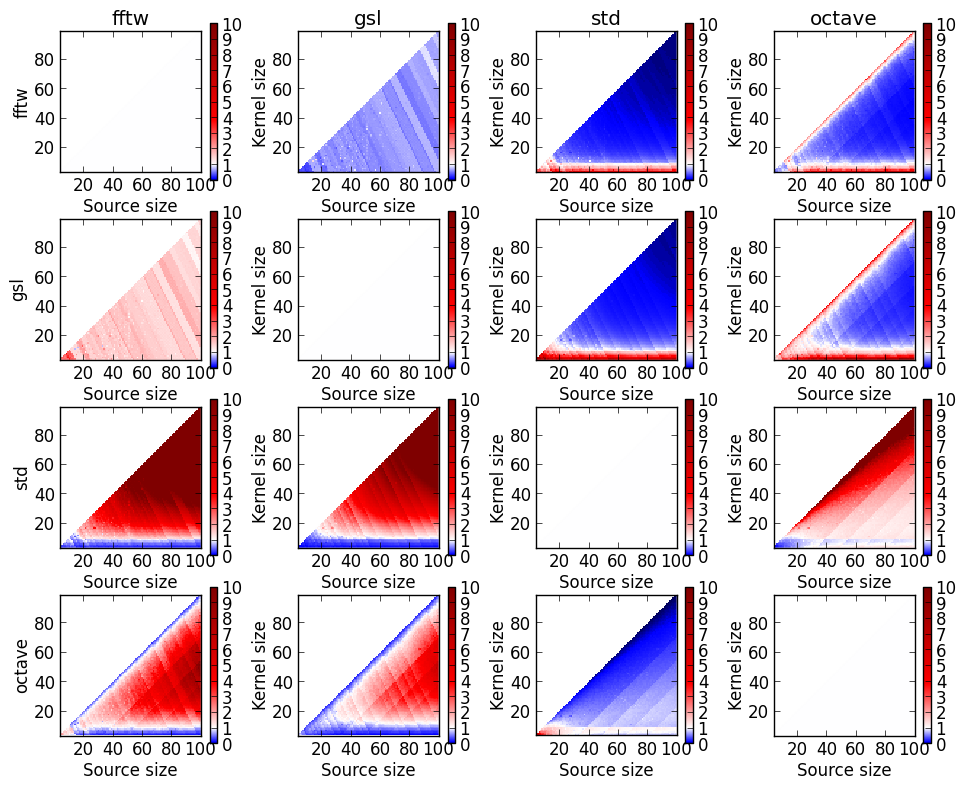
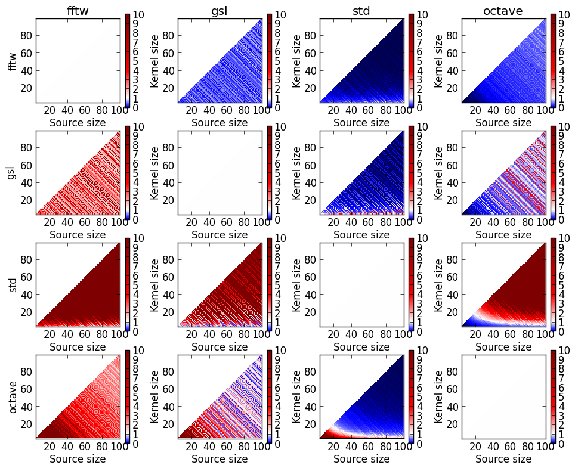

FFTConvolution
==============

The scripts provide some examples for computing various convolutions
products (Full, Valid, Same, Circular ) of 2D real signals. There also some scripts used to test the implementation (against octave and matlab) and others for benchmarking the convolutions. The different implementations that are compared are
- nested for loops
- octave convn and fftconv/fftconv2
- [GSL](http://www.gnu.org/software/gsl/)
- [FFTW](http://www.fftw.org/)

One of the tricks I use with the FFT is to compute, when possible, an
optimal size of the signals to convolve. As the FFT of FFTW and GSL rely on
a prime factor decomposition, it is faster to compute a FFT of a
signal with a size that can be decomposed than of a large prime
size. For some convolutions, you can pad with an arbitrary (lower
bounded) number of zeros. The trick is just to add some more 0's to
get a size that can be decomposed. A description of the convolution products with the FFT is given in the file [FFTConvolution.pdf](FFTConvolution.pdf).

Compilation/Usage
-----------------

Each of the script has a line at the beginning giving the compilation line. You also have a master makefile to :

- run the benchmarks : make benchmarks
- run tests of the implementations against octave and matlab : make test
- plot the comparison (figures below): make plots

The benchmarks are performed for 2D convolutions with source and kernel of sizes up to 100 x 100 ; The tests are performed by generating 50 random sources and kernels in various conditions (1D convolutions with odd/even source and kernel, and 2D convolutions) and comparing the result of the convolution against octave with a tolerance of 1e-12.

Results
-------

Below you will find some benchmarks comparing the execution times of 2D convolution (linear same and circular full) for various implementations :

- C++ using nested for loops
- Octave convn for the linear convolution and fftconv/fftconv2 for the circular convolution
- C++ and FFTW
- C++ and GSL

Below we plot the comparison of the execution times for performing a linear convolution (the result being of the same size than the source) with various libraries. The convolutions were 2D convolutions. The axis refer to the width or height of the source/kernel. When we say a source size of 50, we mean an image 50 x 50.

All these plots show ratio of execution times with a ratio of 1.0 in white. The plots are always one implementation against any other. For example, the first row indicates the ratio of the execution times of FFTW / FFTW, FFTW/GSL, FFTW/ nested for loops, FFTW / octave. The second row is for the gsl, the third for nested for loops and the fourth for octave. Usually, the fastest implementation is the one with the FFTW except when the kernel is of a size up to 10 x 10 where it is faster to use nested for loops or the implementation with Octave. To give some ideas of the speedups, the implementation with the FFTW is 
- between 1 and 2 times faster than the implementation with the GSL
- between 0.3 and 40 times faster than the implementation with nested for loops, but can obvisouly be much faster with increasing sizes
- between 0.2 and 10 times faster than the implementation with Octave

I don't really know why but it seems also faster to use Octave to compute convolution products with kernel of the same size than the source.

The illustration below is for circular convolution (full, i.e. with a result of size (size source) + (size kernel) - 1). 

Here, it is clear that using the FFTW is much faster, whatever the kernel size. To give some ideas of the speedups, the implementation with the FFTW is :
- between 1.5 and 10 times faster than the implementation with the GSL
- between 1.0 and 400 times faster than the implementation with nested for loops
- between 1.5 and 300 times faster than the implementation with Octave

Interestingly, against Octave, the speedup of the implementation with FFTW tends to decrease as the source/kernel sizes increase.